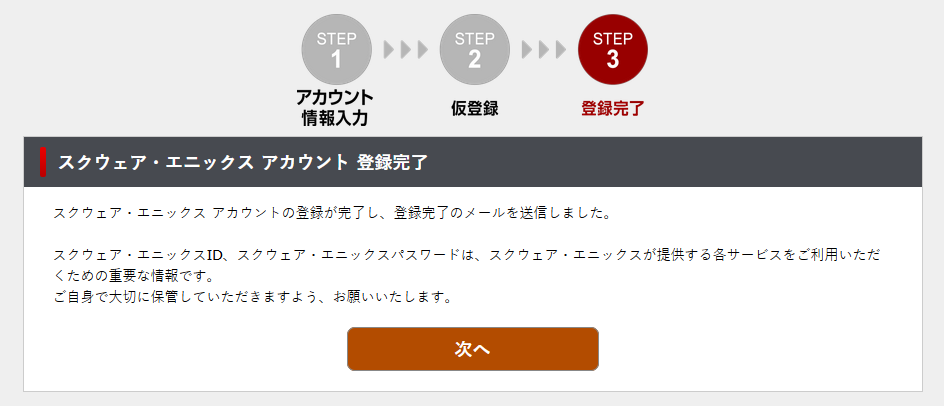

# Start here

## Introduction

Welcome! This is a complete and step by step guide to set up and play 
Dragon Quest X for people who don't understand Japanese 
and/or live in a country where the ip ban is still active.

This guide only covers the free trial version setup. However, the free trial is unlimited in time, there are still things you cannot do in this version, for example you cannot go further than level 50 and you won't have access to all of the story's expansions. But you can play as long as you want without paying anything.

In the future, this guide may cover things such as paying
for a subscription or setting up other versions such as
the PS4 version.

Dragon Quest X only came in Japan, 
and briefly in China before it was shut down, 
but it was sadly never translated into English.
Furthermore, if you live in one of the contries that are ip-blocked 
you'll need to set up a VPN connection.
As of today, the only countries without IP ban are:
- Japan
- China
- The United States

The purpose of this guide is to make an updated version of 
[Ashes'](https://www.woodus.com/forums/topic/28719-getting-started-on-pc), to make it more streamlined, to help you play on switch and to help you set up a vpn connection.

For more info you can check the [Dragon's Den's forum](https://www.woodus.com/forums/forum/100-dragon-quest-x/), [Dragon Quest X Guides and Getting Started](https://ryanquest.com/2020/04/26/dragon-quest-x-guides-and-getting-started/) on Ryan Molina's blog, and the [DQX Gaijins Discord Server](https://discord.gg/U35shqX) where you can find other people to play with and other useful resources.

If you arleady know what you are doing you can quickly 
navigate using the menu on the left. Otherwise, you can
just follow the instructions starting from this page, everything you need to know will be explained.

For any remarks, corrections, suggestions etc contact me on discord at renaud#5914 or directly make 
a pull request on the [Github repository](https://github.com/RenaudTGSTN/RenaudTGSTN.github.io).

## Creating a Japanese Square Enix account

Making a Japanese Square Enix account is the first thing to do regardless of the version you want to play.
>If you already have a Japanese Square Enix account you can directly go to the [next step](README?id=next-step)

>Note: You can do this step later and download the game directly if you want to.

First, go to the [Square Enix account login page](https://secure.square-enix.com/account/app/svc/Login?cont=account).

Click on the big blue "Register for a Square Enix Account" button. You'll be redirected to a registration form. 

On this form, under "Country" select "Japan" and the page will reload.

Enter the information just like the above picture. If you already have a non-Japanese Square Enix account, make sure to use a different address and ID.

Solve the CAPTCHA and then click on the big orange "次へ" (next) button.

You'll be redirected to the following page where you'll have to write a verification code Square Enix sent you by e-mail.

The e-mail should look like something like this:

Once the verification code entered, click on the big orange "登録する"(register) button and you'll be redirected to the following page:

Now, just click on the big orange "次へ" button and that's it. 

Congratulations you made your Japanese Square Enix account!

After registering, you'll recieve a confirmation e-mail that you can safely delete.

## Next step

>/!\IMPORTANT/!\ Do not try one of the streaming versions (3DS, mobile, browser) before activating your trial for Windows, because it will prevent you from activating the trial for the Windows version. That being said, I don't recommand the streaming version at all, as it's not free, and it doesn't play well.

>[Click here if you want to play on Windows](windows)

>[Click here if you want to play on Switch](switch?id=creating-a-japanese-nintendo-account)
