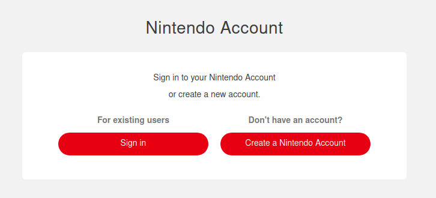
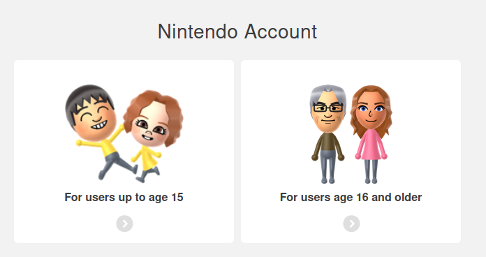
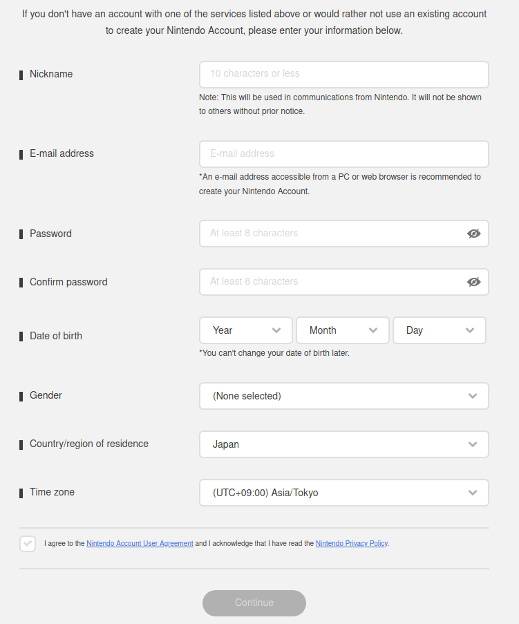
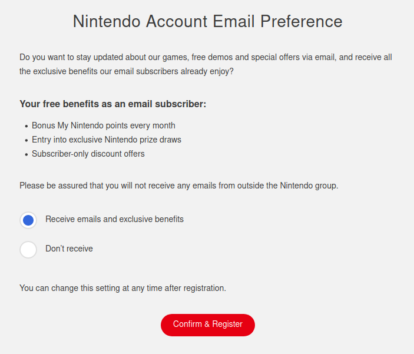
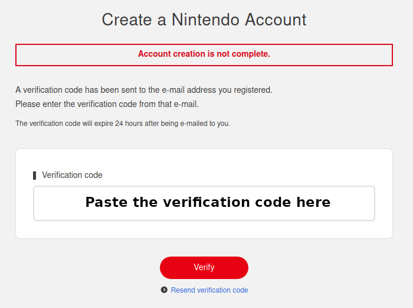
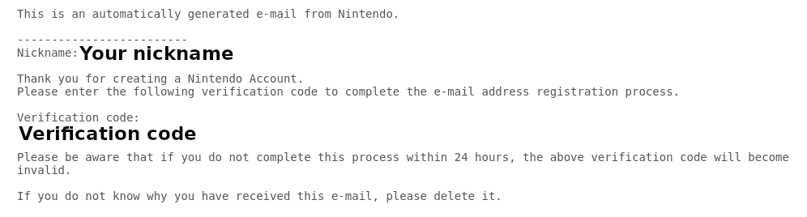
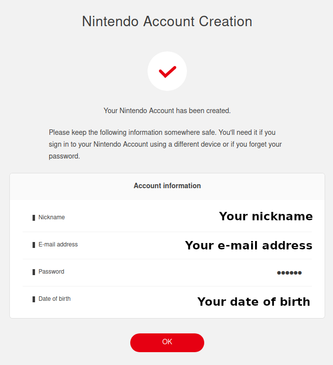

# Creating a Japanese Nintendo account

>If you already have a Japanese Nintendo account you can safely go to [the next step](switch?id=add-a-new-user-to-the-switch).

First, [click here](https://accounts.nintendo.com/authorize_guide?type=mixed&redirect_uri=https%3A%2F%2Faccounts.nintendo.com%2Fconnect%2F1.0.0%2Fauthorize%3Fclient_id%3De56201e414c97a10%26display%3Dtouch%26interacted%3D1%26prompt%3Dconsent%26redirect_uri%3Dhttps%253A%252F%252Fwww.nintendo.com%26response_mode%3Dweb_message%26response_type%3Dcode%2Bid_token%2Btoken%26scope%3DeshopAlps%2BmissionStatus%2BmissionStatus%253Aprogress%2Bopenid%2BpointWallet%2Buser%2Buser.birthday%2Buser.links%255B%255D.id%2Buser.mii%2Buser.wishlist%2BuserNotificationMessage%253AanyClients%2BuserNotificationMessage%253AanyClients%253Awrite%26state%3De8f6c7c48be6b09b54128bb6366b104b%26web_message_target%3Dop-frame%26web_message_uri%3Dhttps%253A%252F%252Faccounts.nintendo.com)

Click on "Create a Nintendo Account"

Select the choice that applies to you.

Once you're on this form, enter the requiered information, then set "Country/region of residence" to "Japan". 

Once the form have been completed, click on the checkbox next to "I agree to the Nintendo Account User Agreement and I acknowledge that I have read the Nintendo Privacy Policy." and click on "Continue".

Here, select what you want. 

After clicking on "Confirm & Register" you'll be redirected to the following page where you'll have to write a verification code Nintendo sent you by e-mail.

The e-mail should look like something like this:

Once the verification code entered, click on "Verify" and you'll be redirected to the following page:

Click on "OK" to end the registration process and close the page. You'll recieve a confirmation e-mail that you can safely delete.

# Add a new user to the Switch

First you need to add a new user to your Nintendo Switch from which you'll link your Japanese Nintendo account to.

Go to your home screen.

screenshot

Select "Nintendo eShop".

screenshot

Then select the "+" on the right.

screenshot

Select "Create New User"

screenshot

Select the icon you want.

screenshot

Enter the nickname you want for this console, it can be different than your account nickname.

screenshot

Select "OK". Now this new user is added to your switch.

screenshot

You can now link your Japanese Nintendo account to this user, or click on "Later" to do it later. Click on "Link a Nintendo Account" and continue to the next step.

# Link your Nintendo account to a Switch user

>If you selected "Later" by mistake in the previous step you can go to this step by selecting your newly created user's icon on the top left of your home screen, then select "Link Nintendo Account" under "Profile".

screenshot

Select "Sign in using an e-mail address or sign-in ID" to connect with your previously created Japanese Nintendo Account.

screenshot

Enter your login info then click no "Sign in".

screenshot

Select "Link".

screenshot

Select "OK".

and that's it. you can now access the Japanese Nintendo eShop!

# Downloading Dragon Quest X

screenshot

On your home screen, select "Nintendo eShop".

screenshot

Select your newly created user.

screenshot

If you get this message just click "OK".

screenshot

Here, it's telling you you'll have to enter your Japanese Nintendo account's password. 

>If you don't want to enter your password each time you go to the eShop just check the box next to "次からスキップする"(skip the next times).

Select "入力する" (input) to enter your password.

screenshot

Here, enter your password then select "OK". You'll be redirected to the Japanese Nintendo eShop.

screenshot

Go to "検索" (search) on the top left of the screen, you can easily identify it as a magnifying glass icon is on the left of it.

screenshot

Here, select the searching field (入力してください) in the middle of the screen to enter the name of the game.

screenshot

You'll have to set your keyboard to japanese. Select the icon that looks like a globe on the bottom left of the screen.

screenshot

Then, select "日本語 ローマ字入力"(Japanese with latin letters input).

Now enter "doragonkuesuto". Normally' as soon as you'll enter the first characters you'll get "ドラゴンクエスト" as a suggestion. That's Japanese for "Dragon Quest": Select it.

Now just add the letter "x" at the end (without space). That's for the latin number "10".

Your input should look like this:

screenshot

Now, select "Accept" then "Search" (or directly "Search" if you alrdeady accepted the input for "x"), and you'll be redirected to the search results:

screenshot

Select the game named "ドラゴンクエストX オンライン"(Dragon Quest X Online). You'll be redirected to the following page:

screenshot

Here, I already downloaded the game so the button on the right (購入済み) may look different to you. I am not sure but on your console it might be "無料ダウンロード" (free download). Anyway, whatever it says, select it to download the game.

You'll be redirected to the download confirmation screen.

screenshot

Click on the "無料ダウンロード" on the bottom right of the screen to confirm download.

screenshot

Now just click on "おわる" (end) to go back to your home screen and wait for your game to download.

# Activate your trial for the Switch version

>If you live in a country where the IP ban is still on you'll first need to connect your switch to a VPN. <a href="#/vpn" target="_blank">follow the vpn guide</a> to do so, then come back here. You need to stay connected to the VPN as long as the game is on.

Once your game have been downloaded, launch it. You'll be redirected to the following screen:

screenshot

Here you first need to register a player, select the big yellow " プレイヤーを登録する"(register a player) button.

screenshot

Here, it's asking you if you already have a Square Enix Account. If you followed this tutorial from the beginning you should already have one. Remember, your account should be a Japanese account.

Select the big blue button on the left that says "すでにスクウェア・エニックスアカウントをお持ちの方"(Already have a Square Enix Account).

screenshot

Enter your Square Enix ID and password.

screenshot

Here, it's asking you if you have a registration code. 

This guide only covers the free trial version, so you normally don't have any code, unless you paid for the game. 

So click on the button at the bottom that says "契約する"(agree). And the game will launch!

screenshot

If you see this screen just push any button.

screenshot

Here is the main menu. I suggest you to quit the game for now as you may want to follow the next step of this guide to make logging onto the game easier.

You can leave the main menu of the game by selecting "ログアウトする"(Logout) at the bottom of it.

# Launching the game

>Remember, as said in the previous section, if you are one of those who need a VPN to play the game make sure you're connected to a VPN before launching the game.

On your home screen just launch your game regularly. You'll then be redirected to the following screen:

screenshot

To play the game, Make sure the dot next to your ID is selected, then  select "次へ"(next).

screenshot

Now, enter your password under "パスワード", and make sure to check "ログイン情報を記憶する"(remember login information) so you won't have to re-enter your password each time you want to play.

Then select "オンラインモードを開始"(start online mode) to play.

Congratulations! You finished setting up Dragon Quest X!