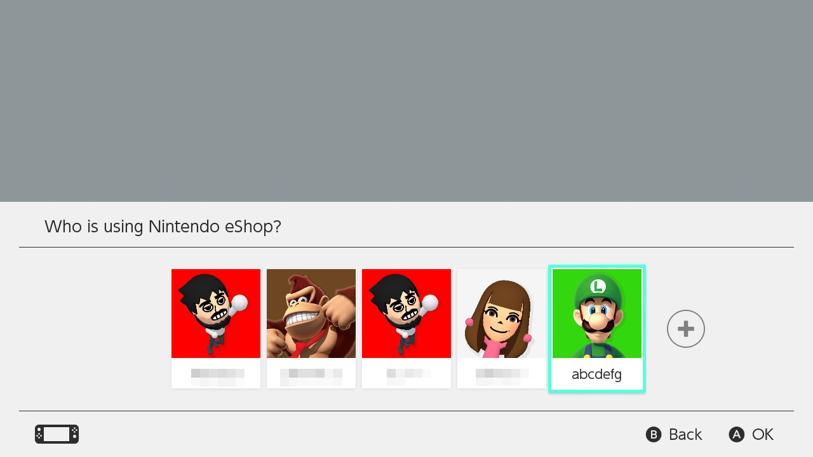
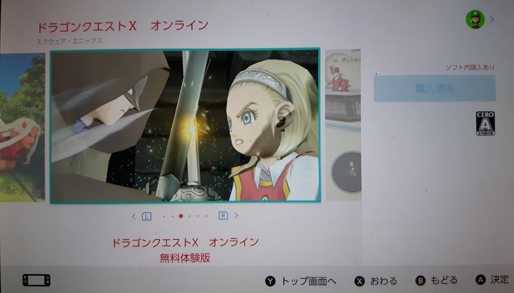
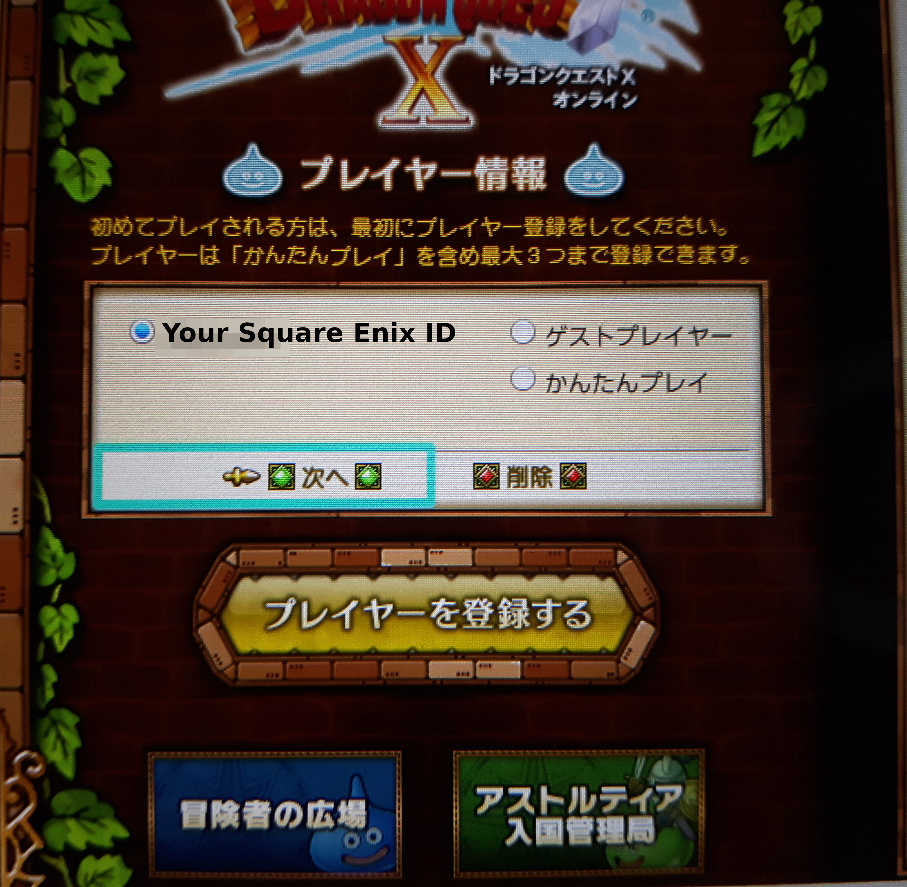

# Switch guide

## Creating a Japanese Nintendo account

>If you live in a country where the IP block is on, don't connect to a VPN right now as it's not needed for the first steps. You will be asked to connect to a VPN later.

>If you already have a Japanese Nintendo account you can safely go to [the next step](switch?id=add-a-new-user-to-the-switch).

>If you already have a user linked with a Japanese account on your Switch, you can directly  [download Dragon Quest X](switch?id=downloading-dragon-quest-x).

First, [click here](https://accounts.nintendo.com/authorize_guide?type=mixed&redirect_uri=https%3A%2F%2Faccounts.nintendo.com%2Fconnect%2F1.0.0%2Fauthorize%3Fclient_id%3De56201e414c97a10%26display%3Dtouch%26interacted%3D1%26prompt%3Dconsent%26redirect_uri%3Dhttps%253A%252F%252Fwww.nintendo.com%26response_mode%3Dweb_message%26response_type%3Dcode%2Bid_token%2Btoken%26scope%3DeshopAlps%2BmissionStatus%2BmissionStatus%253Aprogress%2Bopenid%2BpointWallet%2Buser%2Buser.birthday%2Buser.links%255B%255D.id%2Buser.mii%2Buser.wishlist%2BuserNotificationMessage%253AanyClients%2BuserNotificationMessage%253AanyClients%253Awrite%26state%3De8f6c7c48be6b09b54128bb6366b104b%26web_message_target%3Dop-frame%26web_message_uri%3Dhttps%253A%252F%252Faccounts.nintendo.com)

Click on "Create a Nintendo Account"

Select the choice that applies to you.

Once you're on this form, enter the requiered information, then set "Country/region of residence" to "Japan". 

Just as the Square Enix account, you must use a different e-mail address than the one you use for your regular Nintendo account.

Once the form have been completed, click on the checkbox next to "I agree to the Nintendo Account User Agreement and I acknowledge that I have read the Nintendo Privacy Policy." and click on "Continue".

Here, select what you want. 

After clicking on "Confirm & Register" you'll be redirected to the following page where you'll have to write a verification code Nintendo sent you by e-mail.

The e-mail should look like something like this:

Once the verification code entered, click on "Verify" and you'll be redirected to the following page:

Click on "OK" to end the registration process and close the page. You'll recieve a confirmation e-mail that you can safely delete.

## Add a new user to the Switch

>If you already have a user on your switch with no linked Nintendo account you can go to [the next step](switch?id=link-your-nintendo-account-to-a-switch-user). However, keep in mind that your Japanese Nintendo account will be forever linked to this user.

First you need to add a new user to your Nintendo Switch from which you'll link your Japanese Nintendo account to.

Go to your home screen.

Select "Nintendo eShop".

Then select the "+" on the right.

Select "Create New User"

Select the icon you want.

Enter the nickname you want for this console. It can be different than your account nickname.

Select "OK". Now this new user is added to your switch.

You can now link your Japanese Nintendo account to this user, or click on "Later" to do it later. 

Click on "Link a Nintendo Account" and continue to the next step.

## Link your Nintendo account to a Switch user

>If you selected "Later" by mistake in the previous step you can go to this step by selecting your newly created user's icon on the top left of your home screen, then select "Link Nintendo Account" under "Profile".

Select "Sign in using an e-mail address or sign-in ID" to connect with your previously created Japanese Nintendo Account.

Enter your login info then click on "Sign in".

Select "Link".

Select "OK".

and that's it. you can now access the Japanese Nintendo eShop!

## Downloading Dragon Quest X

On your home screen, select "Nintendo eShop".

Select the user that is linked with your Japanese Nintendo account. That would be the newly created user if you followed the previous steps.

If you get this message just click "OK".

Here, it's telling you you'll have to enter your Japanese Nintendo account's password. 

>If you don't want to enter your password each time you go to the eShop just check the box next to "次からスキップする"(skip this next time).

Select "入力する" (input) to enter your password.

Here, enter your password then select "OK". You'll be redirected to the Japanese Nintendo eShop.

Go to "検索" (search) on the top left of the screen, you can easily identify it as a magnifying glass icon is on the left of it.

Here, select the searching field (入力してください) in the middle of the screen to enter the name of the game.

You'll have to set your keyboard to japanese. Select the icon that looks like a globe on the bottom left of the screen.

Then, select "日本語 ローマ字入力"(Japanese with latin letters input).

Now enter "doragonkuesuto". Normally' as soon as you'll enter the first characters you'll get "ドラゴンクエスト" as a suggestion. That's Japanese for "Dragon Quest": Select it.

Now just add the letter "x" at the end (without space).

Your input should look like this:

Now, select "Accept" then "Search" (or directly "Search" if you alrdeady accepted the input for "x"), and you'll be redirected to the search results:

Select the game named "ドラゴンクエストX オンライン"(Dragon Quest X Online). It should be the first one. You'll be redirected to the following page:

Here, I already downloaded the game so the button on the right (購入済み) will look different to you. On your console it will probably be "無料ダウンロード" (free download):

Anyway, whatever it says, select it to download the game.

You'll be redirected to the download confirmation screen.

Click on the "無料ダウンロード" on the bottom right of the screen to confirm download.

Now just click on "おわる" (end) to go back to your home screen and wait for your game to download.

## Activate your trial for the Switch version

>If you live in a country where the IP ban is still on you'll first need to connect your switch to a VPN. <a href="#/vpn" target="_blank">follow the vpn guide</a> to do so, then come back here. You need to stay connected to the VPN as long as the game is on.

Once your game have been downloaded, launch it. You'll be redirected to the following screen:

Here you first need to register a player, select the big yellow " プレイヤーを登録する"(register a player) button.

Here, it's asking you if you already have a Square Enix Account. If you followed this tutorial from the beginning you should already have one. Remember, your account should be a Japanese account.

Select the big blue button on the left that says "すでにスクウェア・エニックスアカウントをお持ちの方"(Already have a Square Enix Account).

Enter your Square Enix ID and password.

Here, it's asking you if you have a registration code. 

This guide only covers the free trial version, so you normally don't have any code, unless you paid for the game. 

So click on the button at the bottom that says "契約する"(agree). And the game will launch!

If you see this screen just push any button.

Here is the main menu. I suggest you to quit the game for now as you may want to follow the next step of this guide to make logging onto the game easier.

You can leave the main menu of the game by selecting "ログアウトする"(Logout) at the bottom of it.

Then it will ask you if you really want to log out, sselect yes (はい).

## Launching the game

>Remember, as said in the previous section, if you are one of those who need a VPN to play the game make sure you're connected to a VPN before launching the game.

On your home screen just launch your game regularly. You'll then be redirected to the following screen:

To play the game, Make sure your ID is selected, then  select "次へ"(next).

Now, enter your password under "パスワード", and make sure to check "ログイン情報を記憶する"(remember login information) so you won't have to re-enter your password each time you want to play.

Then select "オンラインモードを開始"(start online mode) to play.

Congratulations! You finished setting up Dragon Quest X!