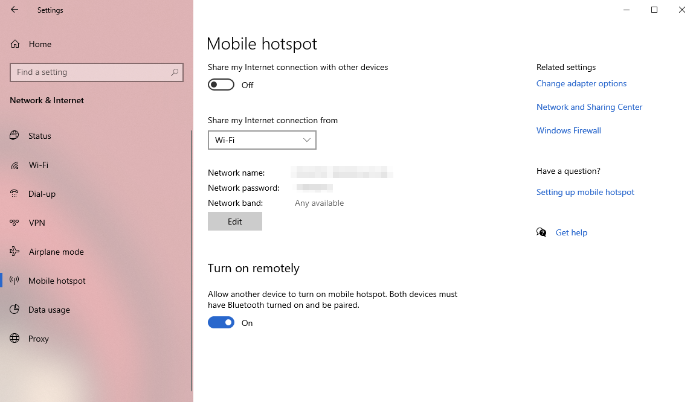
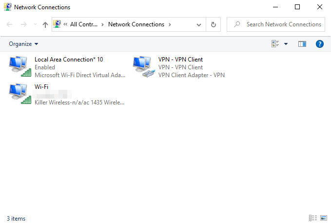

# Setting up a VPN connection
>You can go directly to [the next step](vpn?id=share-a-vpn-connection) if you already have a VPN

## Introduction
By using a VPN you will connect to another machine located in another country (preferably the United States or Japan) to trick Square Enix into thinking you are connecting from said country.
Because of that, the connection speed won't be as good as if you'd connect to the game normally.

Unfortunately, if you live in a country where the IP ban is still on, this is the only way to play Dragon Quest X. Unless you play one of the streaming versions (3DS, browser or mobile). But those are very bad (lots of input lags) and are not free, as you need to pay a subscription for the streaming service.

There are a lot of different VPN providers out there, most of theme are paid services. You can even set up your own VPN server if you know how to do that. 

But if you are reading this section that's probably because you don't already use a VPN and don't know which one to chose.

As I said before, most of the VPNs services are not free, however, I will present you here the service I use which is called "VPN Gate". 

I heard that ProtonVPN is also a good free VPN service. As I never used it myself, I can't write a guide about it. However [you can check it out here](https://protonvpn.com/).

>This guide only covers the use of a VPN to play Dragon Quest X, however it is possible to use it do to other things. Be careful though, as you may want to be familiar with your VPNs term of use. You should also know that the person or organization owning the VPN server can know which websites you visit for example. Everything should be fine as long as you only use it to play Dragon Quest X.

>You should know that if you connect to a different server than the one you connected to previously you will recieve an e-mail from Square Enix asking you to change your password for security reasons. Because it seems someone in another location tried to connect to your account. 
Your Square Enix account will be temporarly blocked until you change your password. If you think this is annoying, try to connect to the same location each time you play.

## VPN Gate

VPN Gate is not a VPN server, it's a service that allows everyone to turn their own computer to a VPN server so everyone else can connect to it.

This project is an academic experiment by the University of Tsukuba in Japan, and thus, the University of Tsukuba also provides its owns servers.

There are multiple ways to connect to VPN Gate servers, you can do it manually or use their software (SoftEther VPN). Everything is explained [on their website](https://www.vpngate.net/en/howto.aspx).

>Keep in mind that because anybody can turn their computer into a VPN server with VPN Gate, you can't have the guarantee that they won't spy on which websites you visit. As I said before, it should be fine as long as you only use it to play Dragon Quest X.

I recommand you to list the servers by score, and to take the server with the highest score that is located in a contry without IP ban, usually that's one of Tsukuba University's servers. However, Tsukuba's servers should only be used for academic use.

# Share a VPN connection
>You don't need to follow the next steps if you play on Windows. You can safely go back to the tutorial you were following.

>There is another way to play on console using a VPN, which is to directly set up a VPN connection through your router. This method isn't covered by this guide though.

>To share your connection you either need to connect your device with the requiered cable (and you'll need an adaptator if your device doesn't have the right port, such as connecting an Ethernet cable to your Nintendo Switch), or a computer that have Wi-Fi to connect your device to. This guide only covers the Wi-Fi connection as I never tried the cable connection. Both methods should work similarly.

## Windows 10

First, you need to connect your computer to a VPN server.

Then, you need to open your computer's settings. This can be done by opening the Start menu then clicking on "Settings".

Click on "Network & Internet"

Go to "Mobile hotspot"

Turn the mobile hotspot on, then click on "Change adapter options". 

The number and name of connections may be different on your computer. Here on my screen you can see three connections:

- Wi-Fi, my regular Wi-Fi connection
- VPN - VPN Client, my VPN connection
- Local Area Connection* 10, my hotspot connection.

You need to find your VPN connection on that list (for me it would be "VPN - VPN Client"), right click on it, then click on "Properties". 

On the new window go to the "Sharing" tab.

Here, check "Allow other network users to connect through this computer's Internet connection", and then under "Home networking connection" select the hotspot connection (in my case it's "Local Area Connection* 10" but it may have a different name on your computer).

Once this is done, you can connect your device to your computer the same way you'd connect your device to a regular router using the Network name and Network password found under the "Mobile hotspot" settings.

## OS X
I didn't test it myself but other people say that [this guide](https://www.expressvpn.com/support/vpn-setup/share-vpn-connection-mac/#setup) works. You don't have to use ExpressVPN. Any other VPN should work the same.

Once this is done, you can connect your device to your computer the same way you'd connect your device to a regular router.