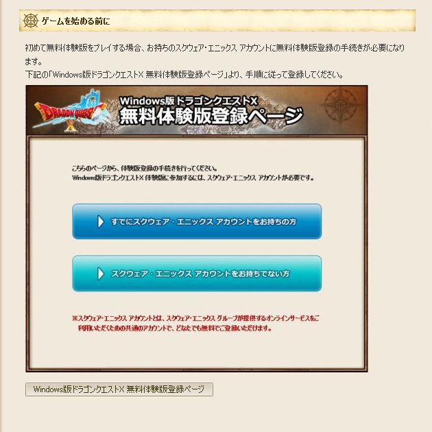
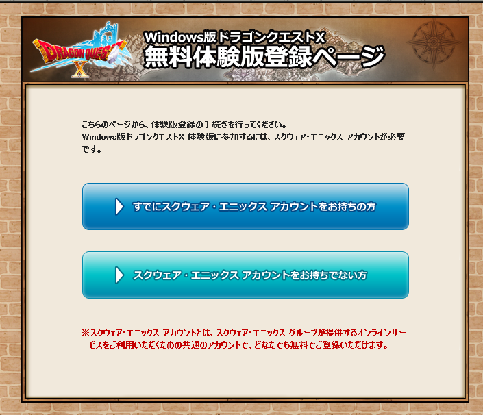
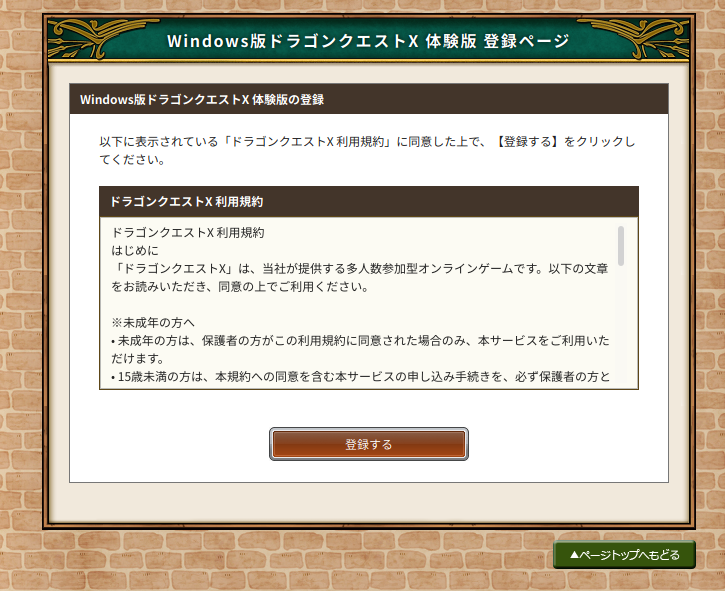
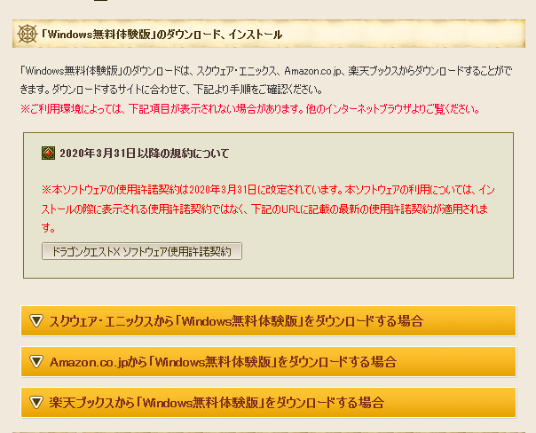
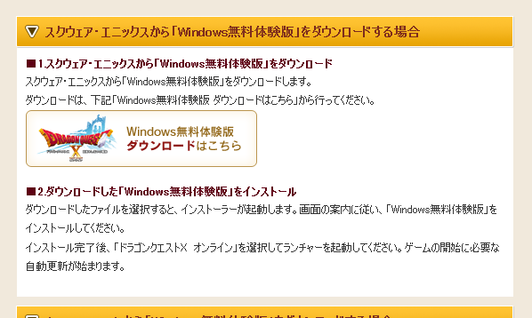
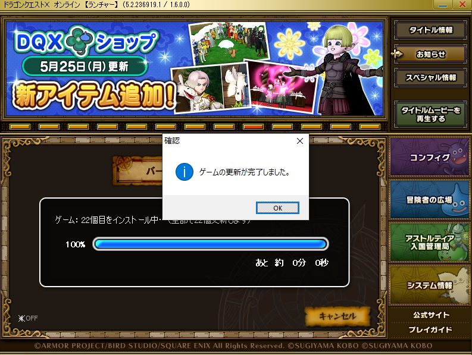
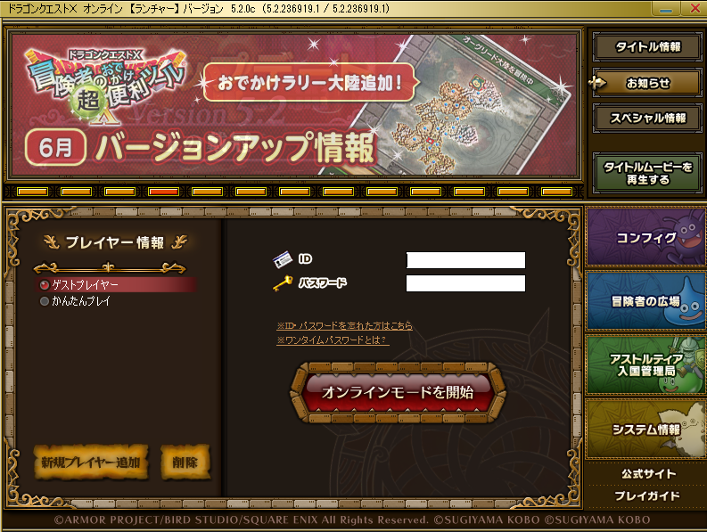

# Windows guide

## Activating the free trial
>If you live in a country where the IP block is on, don't connect to a VPN right now as it's not needed for the first steps. You will be asked to connect to a VPN later.

First, [click here](https://hiroba.dqx.jp/sc/public/playguide/wintrial_1_normal) and scroll a little bit.

Here, click on "Windows版ドラゴンクエストX 無料体験版登録ページ" (Dragon Quest X's Windows free trial activation page)

Click on the big blue button on the top that says "すでにスクウェア・エニックス アカウントをお持ちの方" (Already have a Square Enix Account)

Enter your ID and your password then click on "Log In"

Click on "登録する" (register)

Click on "目覚めし冒険者の広場へ" to go back to the website.

## Downloading the game

Go back to the page you were at the beginning of the previous step ([this one](https://hiroba.dqx.jp/sc/public/playguide/wintrial_1_normal)) and scroll a little bit.

Here, click on the first yellow button, (the one that says "スクウェア・エニックスから「Windows無料体験版」をダウンロードする場合").

Then, click on the big button with the Dragon Quest X logo on it to download the game.

## Installing the game

Once the installer has finished downloading, launch it to install the game.

.png)

Click on "次へ(N) >".

.png)

Click on "すべてインストール".

.png)

Click on "インストール(I)"

.png)

Wait.

.png)

Wait.

.png)

Click on "次へ(N) >".

.png)

Click on "次へ(N) >".

.png)

Check "使用許諾契約の全条項に同意します(A)" if it's not already, and click on "次へ(N) >".

.png)

>Here you can change the installation location if you want.

Click on "次へ(N) >".

.png)

Click on "次へ(N) >".

.png)

Wait.

.png)

>If you want a desktop shortcut, check "デスクトップにショートカットを作成"

Click on "完了".

.png)

Wait.

.png)

Click on "次へ(N) >".

.png)

Click on "次へ(N) >".

.png)

Check "使用許諾契約の全条項に同意します(A)" if it's not already, and click on "次へ(N) >".

.png)

Click on "次へ(N) >".

.png)

Wait.

.png)

Click on "完了".

.png)

Click on "完了(F)".

The game is now installed on your computer.

## Updating the game

>If you live in a country where the IP ban is still on you don't need a VPN to update the game. In fact, you shouldn't be connected to a VPN when updating as it will make the downloading a lot slower.

Launch the game and let it update. It will take a lot of time, so be patient.

Once the game has finished updating click on "OK".

## Playing the game

>If you live in a country where the IP ban is still on you'll first need to connect to a VPN. <a href="#/vpn" target="_blank">follow the vpn guide</a> to do so, then come back here. You need to stay connected to the VPN as long as the game is on.

First, you'll need to add a player to the game. So click on the button on the bottom left that says "新規プレイヤー追加"(add a new player).

Here, under "ID", enter you Square Enix ID. And under "パスワード", enter your password, then click on the green button at the bottom that says "プレイヤー登録" (player registration).

coming soon